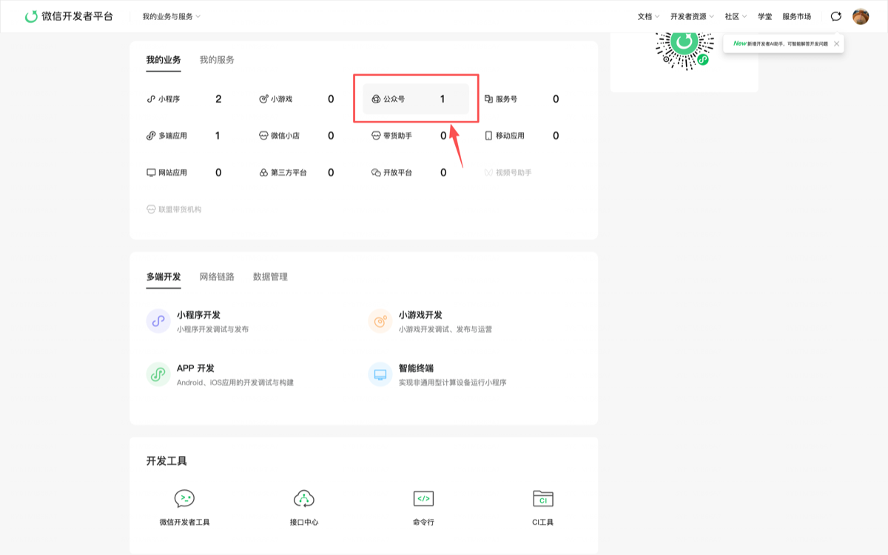
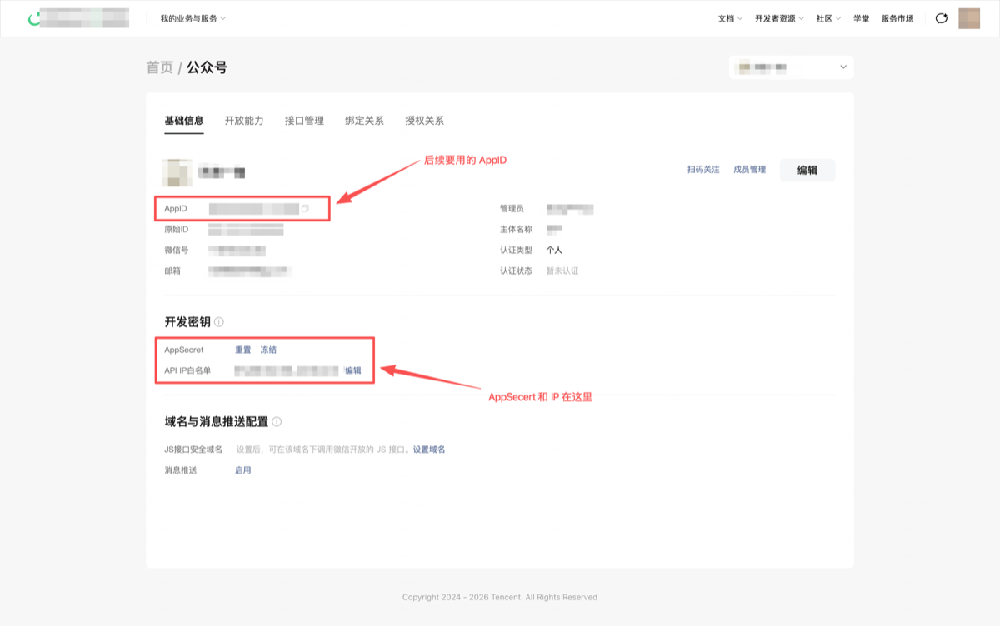

# YouMind WeChat Skill

微信公众号 AI Skill。对 Agent 说一句话，自动跑完选题、写作、配图、排版、发布到草稿箱。

---

## 一句话能干嘛

| 你说 | Skill 做 |
|------|----------|
| `给 demo 写一篇公众号文章` | 全自动 8 步：热点 → 选题 → 写作 → SEO → 配图 → 排版 → 发到草稿箱 |
| `写一篇关于高考志愿的文章` | 跳过热点，直接围绕指定主题走流程 |
| `把这篇 Markdown 发到草稿箱` | 跳过写作，直接排版发布 |
| `用紫色 decoration 主题预览` | 换主题换色，即时预览 |
| `看看最近 7 天文章表现` | 拉数据、分析 top/flop、给下一篇建议 |
| `根据我的修改学习风格` | 从你的人工改稿中提取经验，下次写得更像你 |
| `创建新客户 my-brand` | 自动建目录、引导填品牌配置 |

---

## 安装

> 环境要求：Node.js ≥ 18、Python ≥ 3.9、已认证微信公众号（需 API 权限）

```bash
# 1. 安装依赖
cd toolkit && npm install && npm run build && cd ..
pip install -r requirements.txt

# 2. 生成配置文件（如果 config.yaml 不存在）
cp config.example.yaml config.yaml
```

`config.yaml` 只需要一个字段：

| 字段 | 必填 | 说明 |
|------|------|------|
| `youmind.api_key` | **是** | YouMind API Key → [获取入口](https://youmind.com/settings/api-keys?utm_source=youmind-wechat-article) |

WeChat 凭据**不在 skill 本地存** —— 走 YouMind connector 加密保存，下面单独说。

### 在 YouMind 绑定 WeChat 公众号（一次性）

1. 打开 [微信公众平台](https://mp.weixin.qq.com)，**设置与开发 → 基本配置**

   

2. 在「公众号开发信息」区域复制 **AppID**，并点击「重置」获取 **AppSecret**（只展示一次）

   

3. 打开 [YouMind Connector Settings](https://youmind.com/settings/connector?utm_source=youmind-wechat-article)，选择 **WeChat**，粘贴 AppID / AppSecret / 作者名，保存。YouMind 立即调 `cgi-bin/token` 验证 — 绿勾代表绑定成功

   

**为什么不在本地存 secret？**

- secret 加密落库在 YouMind，泄漏面更小
- access_token 由 YouMind 服务端缓存（2hr TTL，命中省一次 token 请求）
- **无需 IP 白名单** —— YouMind 出口 IP 已在 WeChat 侧白名单里

要轮换密钥就回 WeChat 平台重置 secret，再回 connector 重新粘贴即可。

### 验证

```bash
cd toolkit && node dist/cli.js validate
```

期望 `OK: Connected to WeChat Official Account wxxxxxxxxxx`。

---

## 使用技巧

### 两种运行模式

- **自动模式**（默认）：全程自动跑，只在生成配图前问一次图片风格偏好
- **交互模式**：说"让我来选题" / "交互模式"，会在选题、框架、配图、主题环节暂停让你选

### 主题系统

4 款内置主题，搭配任意 HEX 色值：

| 主题 | 风格 | 适合 |
|------|------|------|
| `simple` | 简约干净 | 日常推送、知识科普 |
| `center` | 居中排版 | 短篇、金句、情感 |
| `decoration` | 装饰线条 | 品牌感强的内容 |
| `prominent` | 大标题 | 深度长文、观点输出 |

<!-- TODO: 主题对比截图 -->

想要更深的定制？用 Theme DSL 写一个自定义主题 JSON，放到 `clients/{client}/themes/` 下，发布时加 `--custom-theme` 即可。

### 配图降级链

Skill 按以下顺序尝试生成配图，任何一环成功就继续，全挂也不中断流程：

```
AI 生图（你配的 provider）→ Nano Banana Pro 图库搜索 → CDN 预制封面下载 → 只输出 prompt
```

### 多客户管理

每个客户一个目录，互不干扰：

```
clients/demo/
├── style.yaml      # 品牌调性、目标读者、禁用词
├── playbook.md     # 写作手册（自动生成或手写）
├── history.yaml    # 已发布记录（去重用）
├── corpus/         # 历史语料
├── lessons/        # 人工改稿经验
└── themes/         # 专属主题
```

对 Agent 说 `创建新客户 xxx` 即可自动初始化。

### 让文章越写越像你

1. **喂语料**：往 `clients/{client}/corpus/` 里放 20+ 篇你的历史文章，跑 `build-playbook` 生成写作手册
2. **改稿学习**：发布后手动改，然后说"根据我的修改学习风格"——Skill 会提取差异存到 `lessons/`
3. **手册迭代**：每积累 5 条经验，自动刷新 `playbook.md`

### 流程不会断

每一步都有 fallback。热点抓不到就联网搜，联网搜也挂就问你；图生不出来就搜图库；发布失败就生成本地 HTML。单步失败只会跳过并标注，不会卡死。

---

## 常见问题

**发布报 IP 错误** — 公网 IP 变了。重跑 `curl -s https://ifconfig.me` 拿新 IP，更新微信白名单（详见上方「获取本机公网 IP」章节）。

**图片生成失败** — 不影响发布。Skill 会自动走降级链。想用特定 provider 就在 `config.yaml` 里填对应 key。

**文章有 AI 味** — 在 `style.yaml` 里写清楚你的调性；多喂历史语料建 playbook；发布后改稿再跑"学习风格"。三管齐下效果最好。

**怎么自定义排版？** — 三个层级：① 对话里指定颜色字号 → ② 写 Theme DSL JSON → ③ 搭配设计类 Skill 深度定制。

---

## 项目结构

### Toolkit scripts (TypeScript, 在 `toolkit/src/` 下)

| 文件 | 作用 | 对应 npm script |
|------|------|---------------|
| `cli.ts` | 主 CLI 入口（preview / publish / validate / list / themes） | `npm run preview` / `publish` 等 |
| `image-gen.ts` | YouMind 图像生成 + Nano Banana Pro 库 + CDN 降级 | `npm run image-gen` |
| `youmind-api.ts` | YouMind OpenAPI 客户端（知识库、搜索、chat、公众号代理） | `npm run youmind-api` |
| `fetch-stats.ts` | 拉公众号历史文章互动数据做分析 | `npm run fetch-stats` |
| `build-playbook.ts` | 喂历史语料生成客户专属写作手册 | `npm run build-playbook` |
| `learn-edits.ts` | 从人工改稿差异中提取风格经验 | `npm run learn-edits` |

### Scripts (Python, 在 `scripts/` 下)

| 文件 | 作用 |
|------|------|
| `scripts/fetch_hotspots.py` | 抓微博 / 知乎等热点榜单 |
| `scripts/seo_keywords.py` | 关键词评分 + 去重 |
| `scripts/validate_skill.py` | 结构校验（`npm run validate-skill` 调用） |

### Agent config

`agents/openai.yaml` — OpenAI / Codex agent 的 skill 接入清单。

### Client templates

`clients/demo/` 是客户配置模板（`style.yaml` + `history.yaml`）。复制到 `clients/{your-client}/` 并改写即可新建一个客户。

### 验证

跑 `npm run validate-skill` 检查目录结构、必需文件、必需 headings 是否完整。

---

## 许可证

MIT
